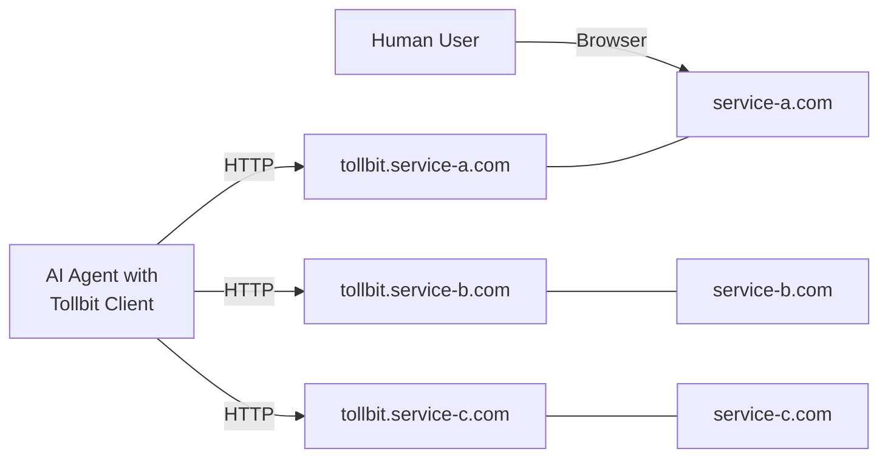

<p align="center">
  
</p>

<h3 align="center">Tollbit: Front Door Access for AI Agents</h2>

<p align="center">Web automation, API access, and content access all through a standard entry point.</p>

<br>

<p align="center">
  <a href="https://github.com/tollbit/tollbit-python-sdk/stargazers"></a>
  <a href="https://docs.tollbit.com"></a>
  <a href="https://twitter.com/tollbitofficial"></a>
</p>

# Tollbit

A managed entry point to any web app, specifically meant for AI agents. Direct, authorized, and reliable agent <-> service interactions for any web service on the internet. Built for web automation, API access, and content access.

## Why Tollbit Exists

It's no secret that AI agents are going to run the web in the near future. However, for that to become a reality, the way agents interact with the internet needs to change. Currently, agent builders' options are limited to typical developer APIs and/or web automation. While great for demos, these patterns seem like the initial "hack" waiting for a more long term solution.

Developer APIs work well, but there is a very short list beyond the overused Google Drive, Slack, etc. Web automation is extremely slow, unreliable and insecure. Not only that, but most websites don't want bots on them, leading to doing all the grunt work of solving captchas and avoiding getting blocked.

The main reason for all this trouble? The web was not built for agents to be first class citzens.

Tollbit aims to build critical infrastructure that opens up new pathways for agents to act on the web, at native speed, and to actually bring real value to their users.

We are building on one ethical principle: **agents shouldn't (need to) pretend to be humans on the internet**.

This approach solves problems for both sides: website owners gain a reliable way to identify legitimate AI agents, manage their access privileges, and monetize their usage, while AI developers get stable, authorized access to first-party APIs, content, or web UI.

## How Tollbit Works

Tollbit creates a gateway for AI agents through a simple convention:

**Any service with a `tollbit` subdomain (`tollbit.example.com`) explicitly welcomes agent access with standardized authorization, permissions, and monetization.**

We call this subdomain the "front door" - a dedicated entry point built specifically for AI agents, separate from human traffic.



## For Service Providers

Tollbit lets you monetize AI agent access to your service without building custom infrastructure:

- Implement once, work with any agent
- Set different pricing tiers and usage limits
- Separate human and bot traffic transparently
- Prevent abuse through standardized authentication

## For AI Developers

Tollbit gives your agents reliable access to services:

- One consistent pattern for authentication and access
- No more brittle web automation that breaks with UI changes
- Clear permissions model designed for non-human users
- Focus on building intelligence, not maintaining integration code

# tollbit-python-sdk

Tollbit's python SDK for interacting with Tollbit's services. Pull this directly into your code to make requests; no need to write your own clients. 

The SDK currently supports the following operations:

- [Checking rates for paid content](#checking-rates)
- [Access paid content using your organization's API key](#accessing-paid-content)

## Installing

```shell
pip install tollbit-python-sdk
```

## Checking Rates

```python
from tollbit import use_content

client = use_content.create_client(
    secret_key="YOUR API KEY", 
    user_agent="YOUR USER AGENT"
)
rate_info = client.get_rate(url="https://pioneervalleygazette-foo.com/daydream")
```

For more examples please see [examples/get_rates.py](examples/get_rates.py).

## Accessing sanctioned content

```python
from tollbit import use_content
from tollbit import licences
from tollbit import currencies

client = use_content.create_client(
    secret_key="YOUR API KEY", 
    user_agent="YOUR USER AGENT"
)

data = client.get_sanctioned_content(
    url="https://pioneervalleygazette.com/daydream",
    max_price_micros=11000000,
    currency=currencies.USD,
    license_type=licences.ON_DEMAND_LICENSE
)

print(data.content.main)
```

For more examples please see [examples/get_content.py](examples/get_content.py).


## Issues
We have disabled issues for the time being. Please reach out directly to tollbit

## Contributions
We are not currently accepting contributions at this time. Thank you for your interest.

## Local setup
_For internal development teams only_

### Requirements

- [pyenv](https://formulae.brew.sh/formula/pyenv)
- poetry
    
    ```shell
    pipx install poetry
    ```

### Setup

```shell
make install
```

### Tests

Run standard tests
```shell
make tests
```

Run on all pythons
```shell
make matrix-tests
```

## Examples

_TODO_
